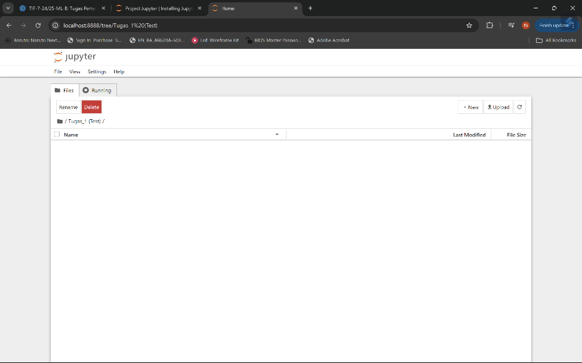
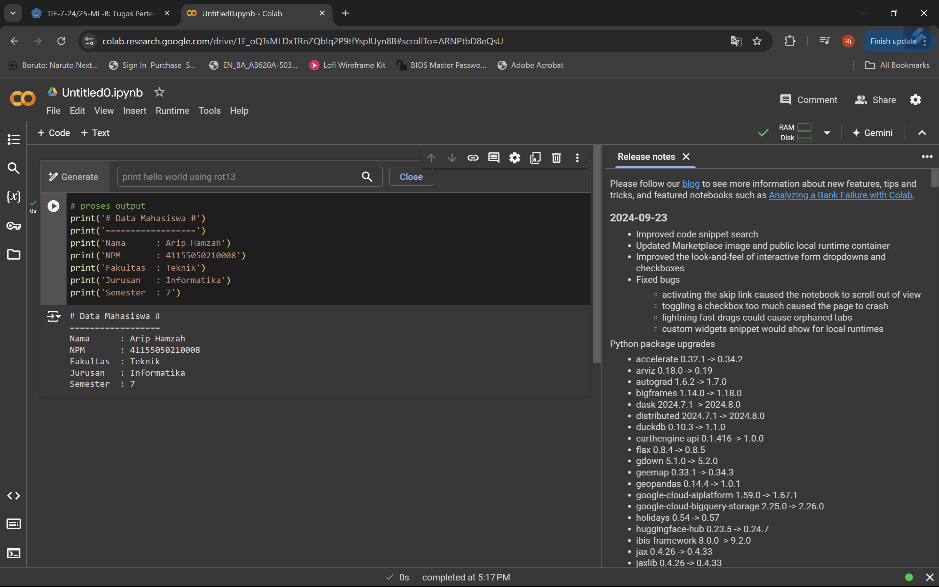
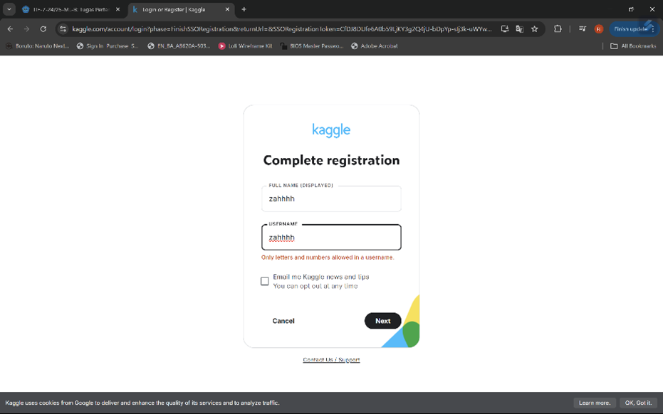

1.	Instalasi Jupyter Noterbook
-	Download 
 
  
-	Instal library
  
-	Membuka Jupyter Notebook
  
-	Mencoba menggunakan dengan mengetik Nama dan NPM 
  
-	Mencoba membuat program sederhana 
  
  
 
2.	Google Collab 
-	Mencoba menggunakan Google Collab
  
-	Output / Hasilnya 
  
3.	Kaggle 
-	Membuat akun di Kaggle 
  
-	Masuk dengan akun yang telah dibuat
  
4.	Github 
-	Membuat akun di Github dan membukanya 
  

 
5.	Praktek Sample Dataset pada Scikit-Learn
1)	Load Sample dataset 
-	Mengimport sklearn.datasets
  
-	Mendata keys yang tersedia 
  
2)	Metadata
-	Mengakses metadata deskripsi dari sample dataset 
  
3)	Explanatory & Response Variables
-	Mengakses Explanatory Variables (Features)
  
-	Mengakses Response Variables (Features)
  
4)	Feature & Target names 
-	Mengakses Features names 
  
-	Mengakses Target names 
  
5)	Visualisasi data
-	Visualisasi sepal length & width 
  
6)	Training set & Testing set 
-	Training set & Testing set
  
7)	Load sample dataset sebagai pandas data frame 
  
6.	Praktek Machine Learning Workflow dengan Scikit-Learn
1)	Persiapan dataset (Loading & splitting dataset)
  
2)	Training model Machine Learning 
  
3)	Evaluasi model Machine Learning
  
4)	Pemanfaatan Trained model Machine Learning 
  
5)	Deploy Model Machine Learning (Dumping dan Loading model Machine Learning)
  
 
7.	Praktek Data Preprocessing dengan Scikit-Learn
1)	Persiapan sample dataset
  
2)	Teknik data preprocessing 1: binarization
  
3)	Teknik data preprocessing 2: scaling
  
4)	Teknik data preprocessing 3: normalisation
-	Least Absolute Deviations
  
-	Least Squares
  

