SINGLE PERCEPTION
1.	Membuat table logika biner AND 
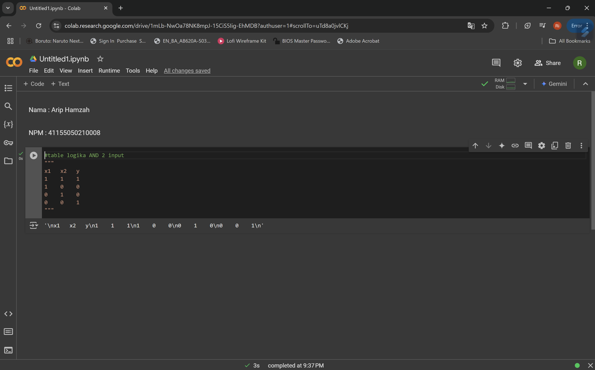 
2.	Tambahkan atau deklarasikan library dan model yang akan digunakan 
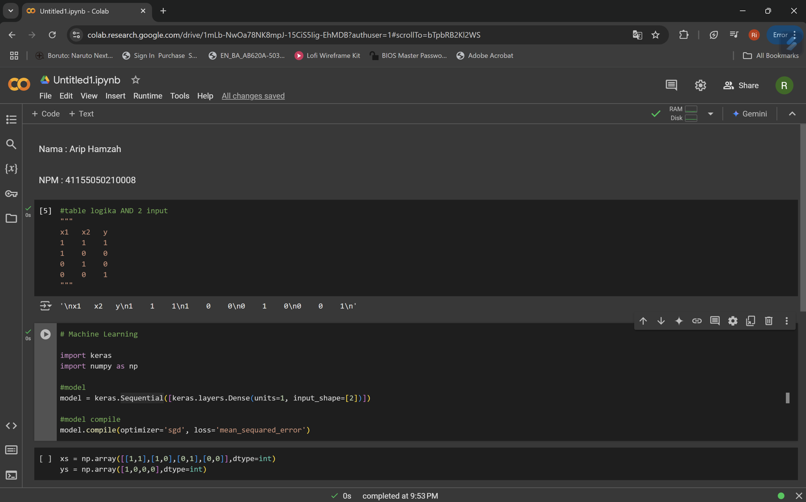 
3.	Buat set data 
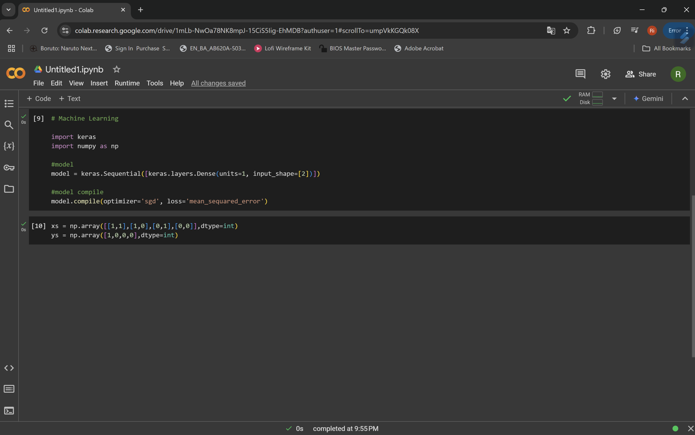 
4.	Tampilkan arsitektur awal 
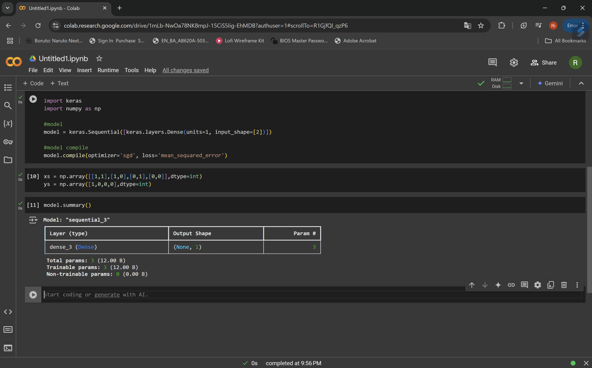 
5.	Cek bobot model awal
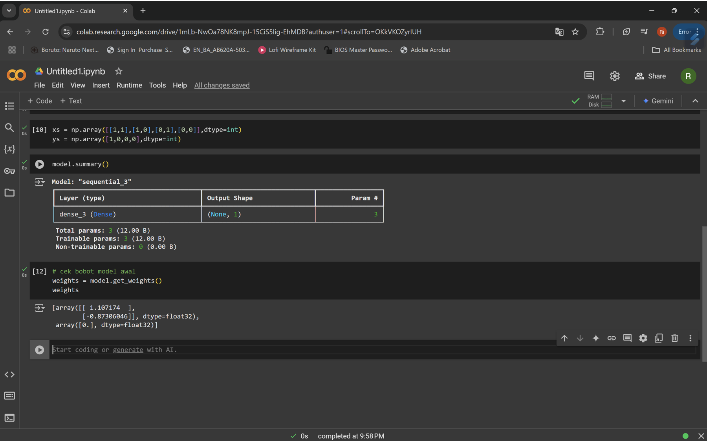 
6.	Training 
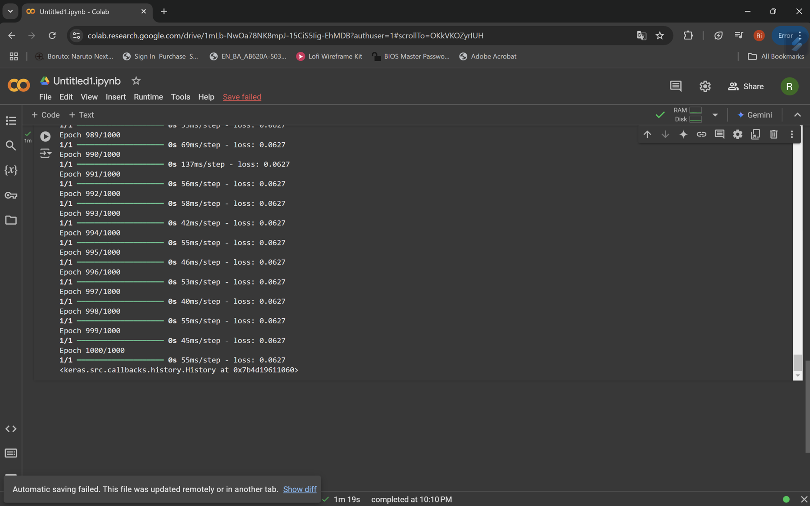 
7.	Test 
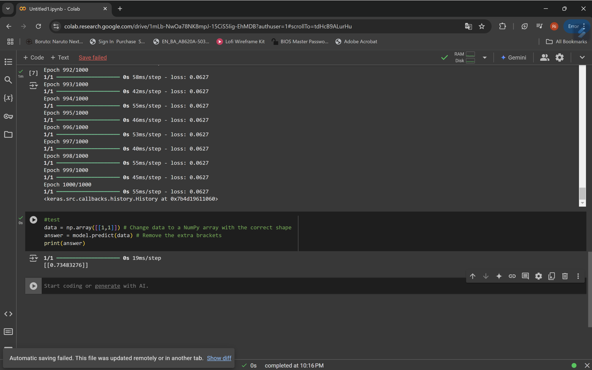 
8.	Lihat bobor akhir
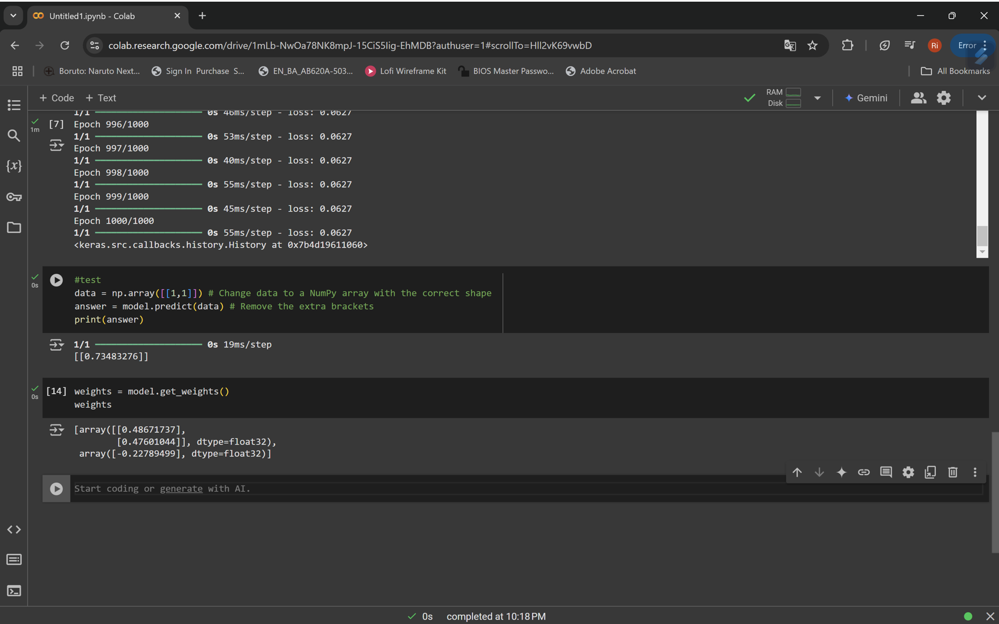 
9.	Buat table data baru
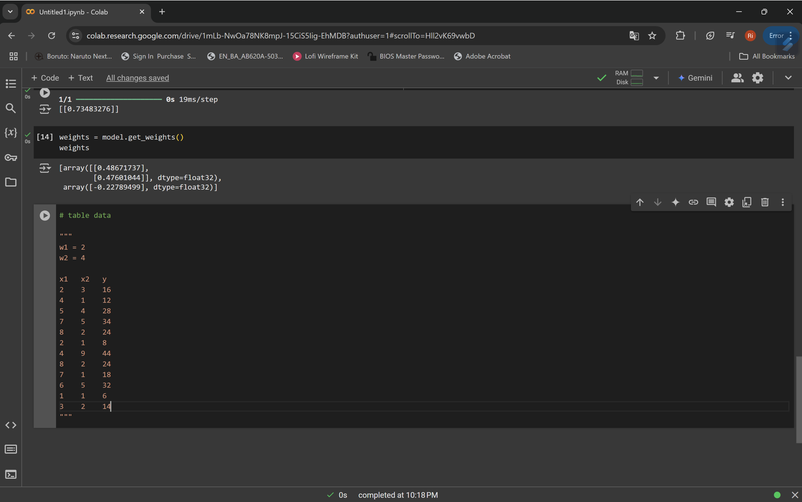 
10.	Buat model baru 
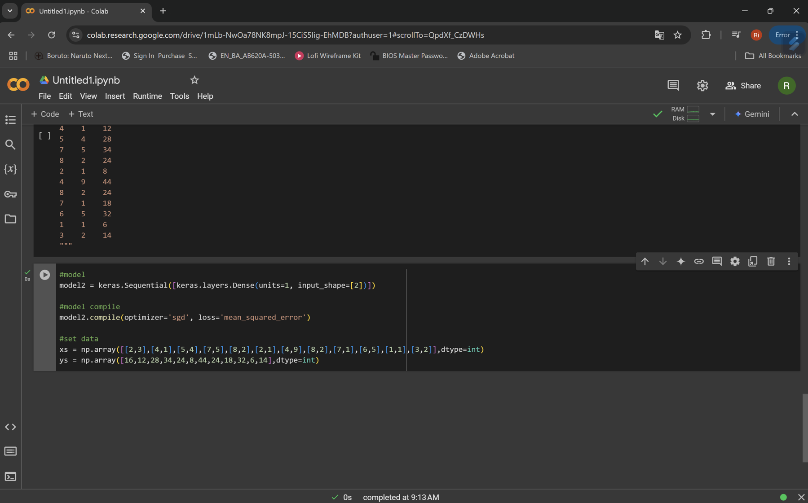 
11.	Cek bobot model awal 
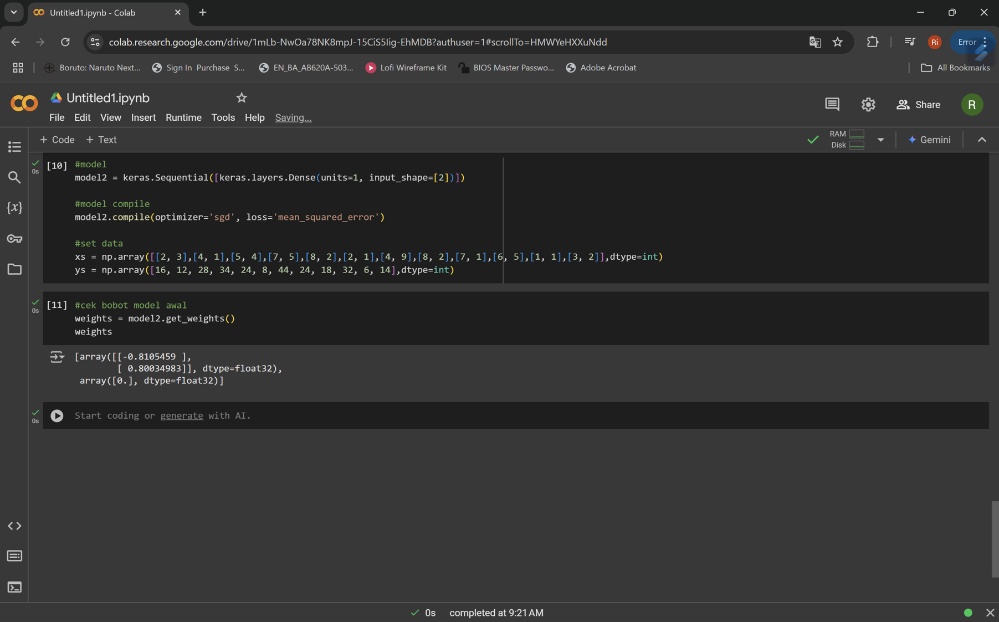 
12.	Training model ke 2
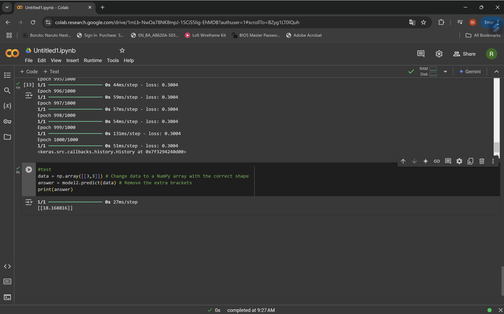 
13.	Mengambil bobot dari model
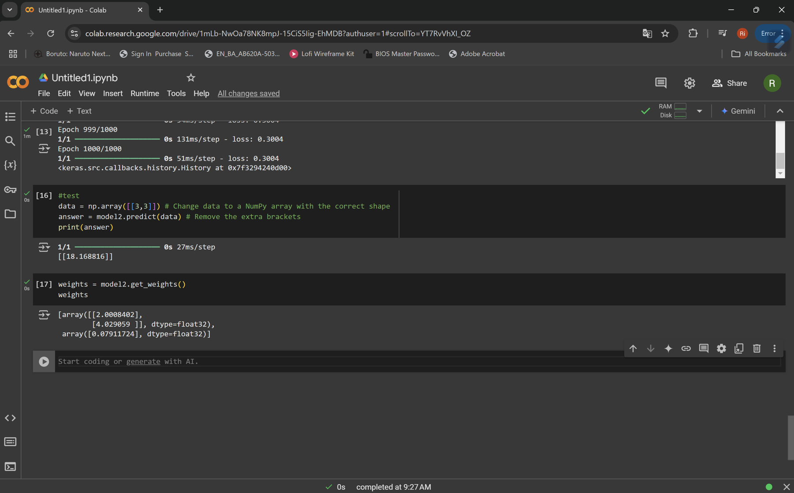 
