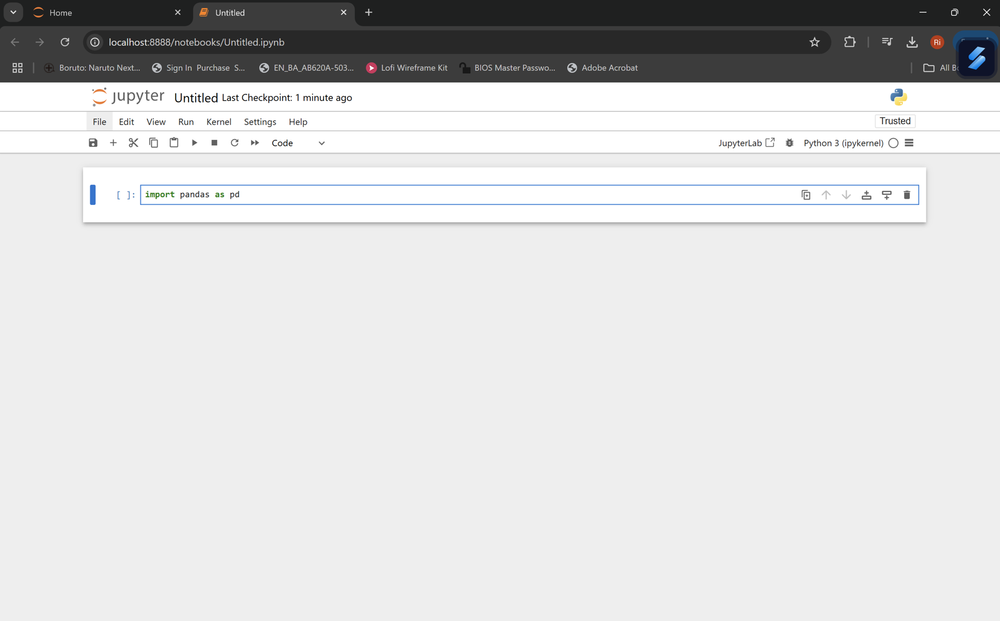
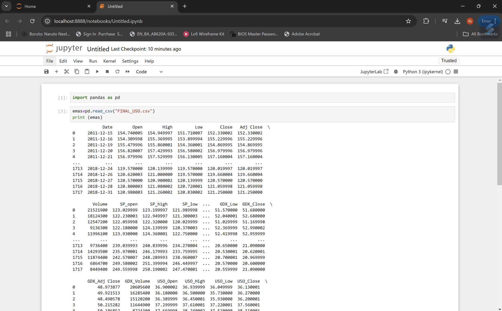
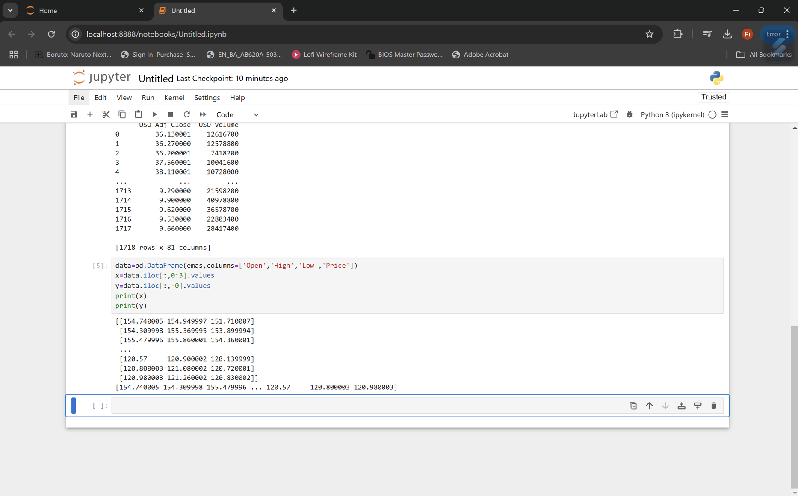
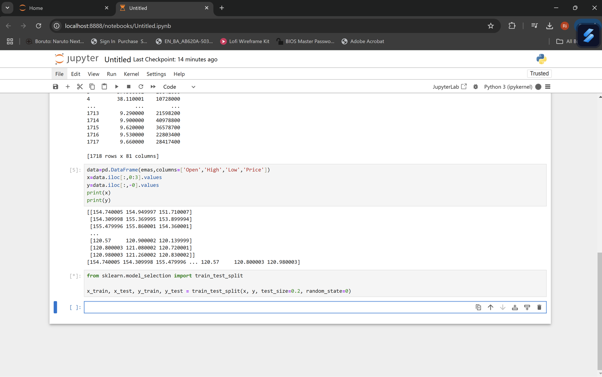
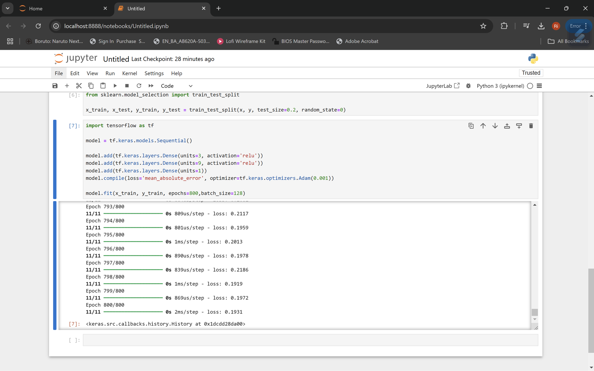
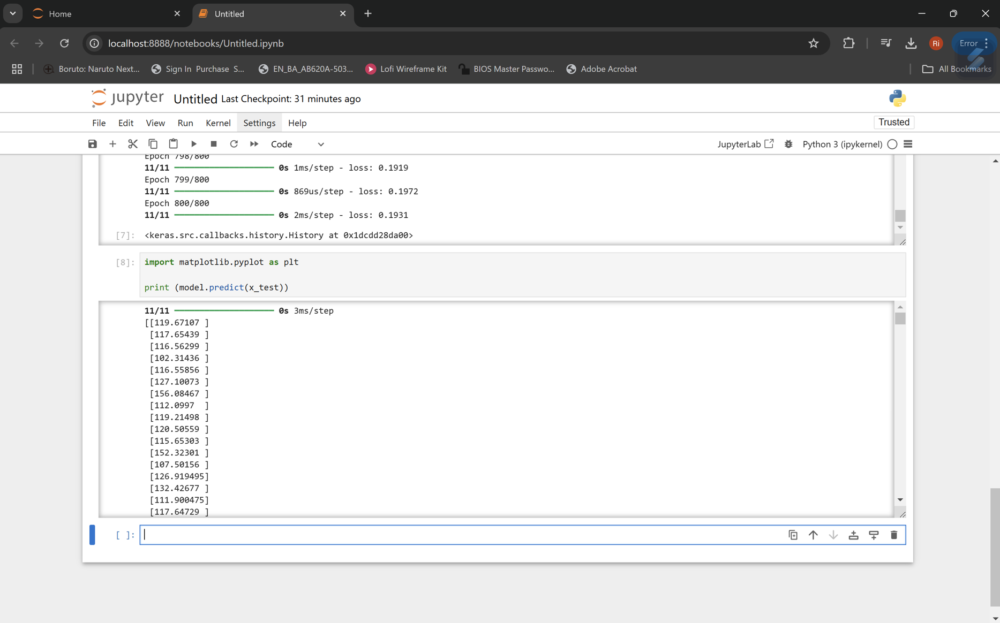
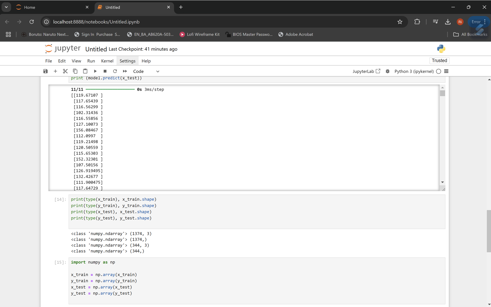
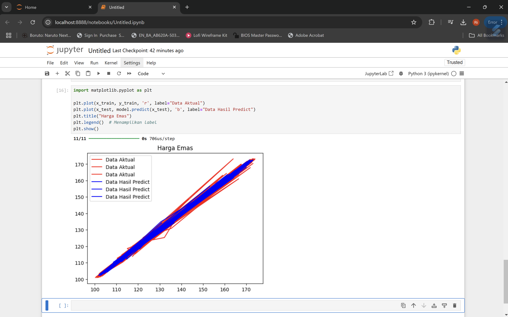

BACK PERCEPTION Memprediksi Harga Emas
1.	Mengimport Library 
 
2.	Mengambil data yang dimiliki 
 
3.	Mengambil variable input dan output
 
4.	Membagi data Training dan Testing 
 
5.	Membuat model arsitektur back-perception 
 
6.	Memasukan library untuk menampilkan data 
 
7.	Konversi numpy.ndarray 
 
8.	Plot Data 
 
