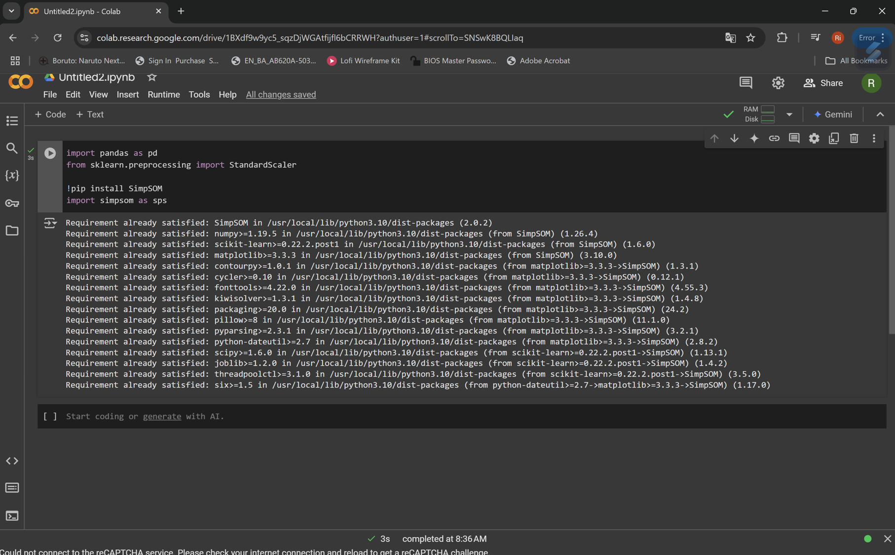
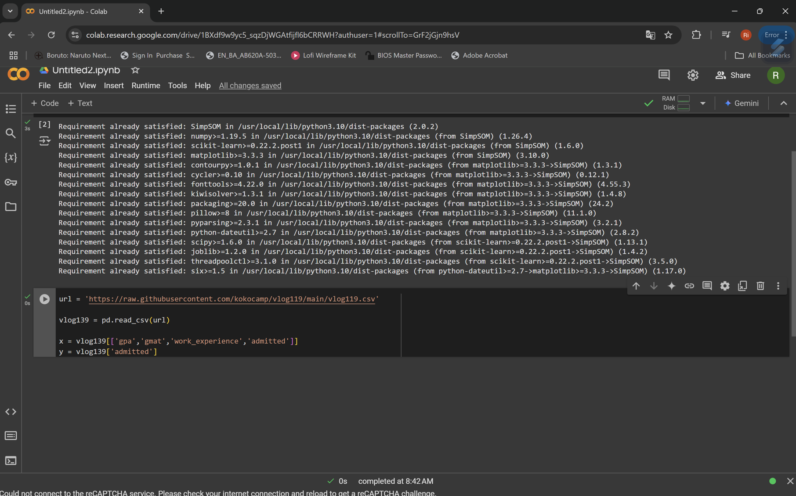
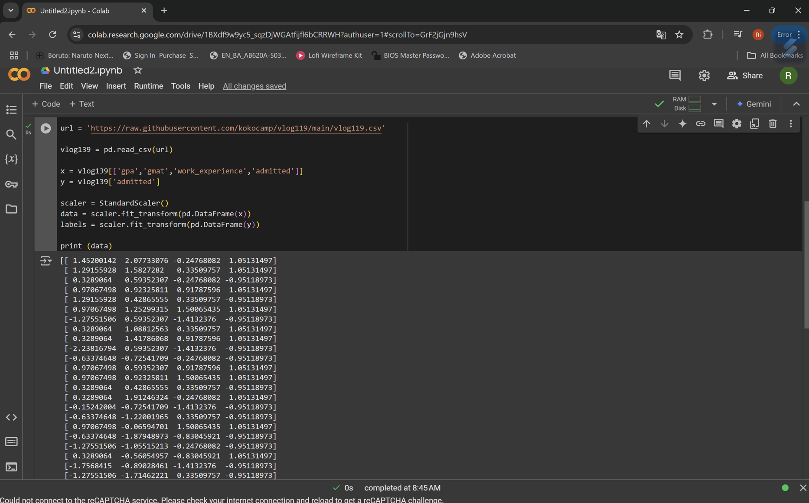
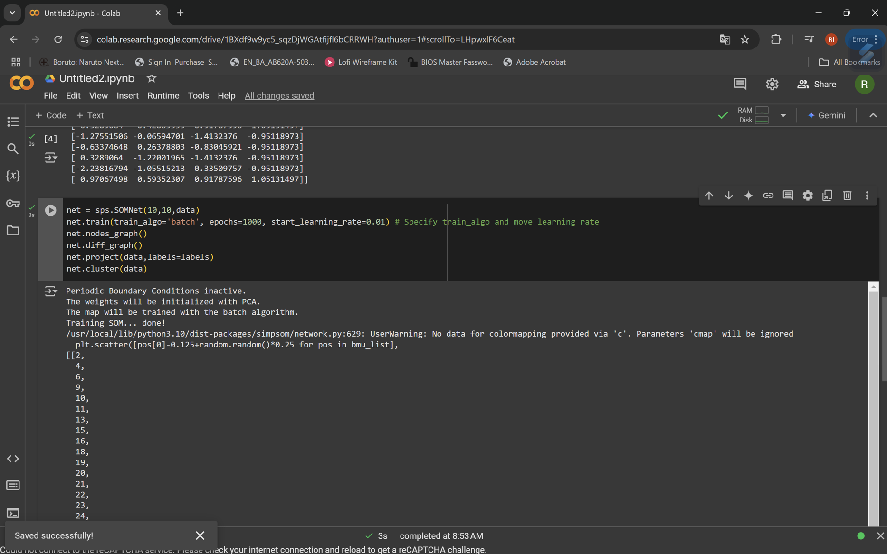
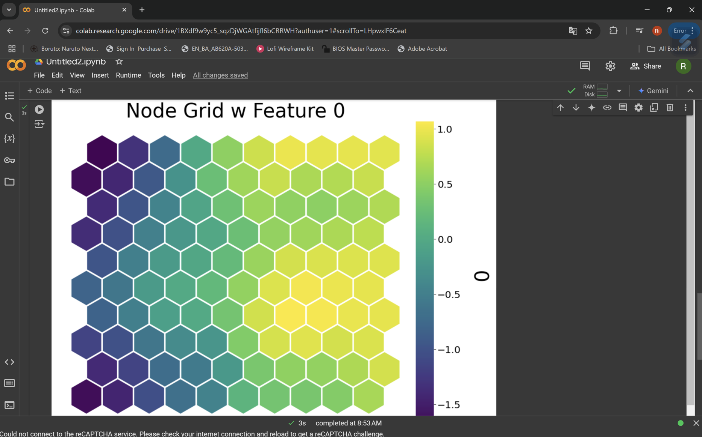

SELF ORGANIZING MAPS
1.	Mengimport Library dan mendownload library SimSOM
 
2.	Mengambil data dari url github 
 
3.	Melakukan stampsel pada data yang sudah di import 
 
4.	Menampilkan Hasil dengan membuat clustering point

