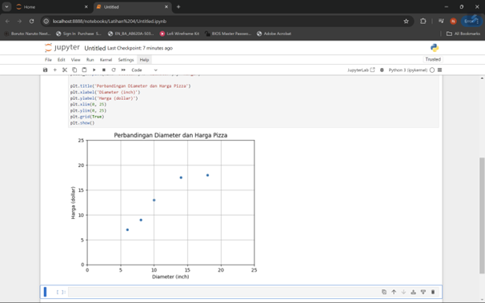
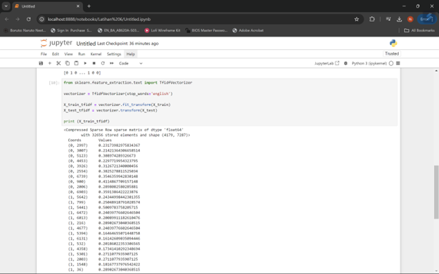

1.	Simple Linear Regression dengan Scikit-Learn
1)	Sample dataset 

2)	Visualisasi dataset

3)	Transformasi dataset 

4)	Training simple linear regression Model 

 

5)	Visualisasi simple linear regression model 

 

 

6)	Kalkulasi nilai slope

 

7)	Kalkulasi nilai intercept 

 

8)	Prediksi harga pizza dengan simple linear regression model 

 

9)	Evaluasi model dengan coefficient of determination 
 
 

10)	Kalkulasi nilai R square

 
 
 
 
 2.	Multiple Linear Regression & Polynominal Regression 

1)	Persiapan sample dataset 

 

2)	Preprocessing dataset 

 
 
3)	Pengenalan multiple linear regression 
 
 

4)	Pengenalan polynominal regression 

 

5)	Quadratic polynominal regression 

 
 
 

6)	Linear regression vs Quadratic polynominal regression vs Cubic polynominal regression 

 

3.	Logistic Regression pada Binary Classification Task

1)	Formula dasar pembentuk logistic regression 

 

 

2)	Persiapan dataset

 

3)	Pembagian training dan testing set 

 

4)	Feature extraction Dengan TF-IDF

 

5)	Binary Classification dengan logistic regression \

 

6)	Evaluasi metrics pada binary classification tast 

-	Pengenalan confusion matriks 

 

 

-	Pengenalan accuracy scope 

 

-	Pengenalan precision dan recall

 

-	Pengenalan F1 score | F1 Measure

 

-	Pengenalan ROC | Receiving Operating Characteristic 

 
