1.	Decision Tree Classification 
1)	Pengenalan komponen Decision Tree: root, node, leaf

 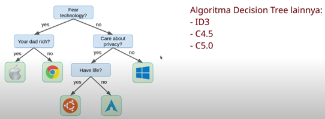

2)	Pengenalan gini impurity 
 
 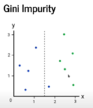       
 
 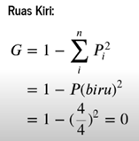
 
 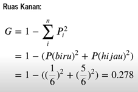

 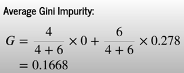  

3)	Pengenalan information gain 

 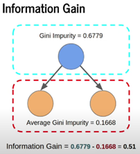  

4)	Membangun Decision Tree

 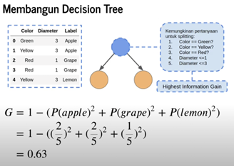  

5)	Persiapan dataset: iris Dataset 

 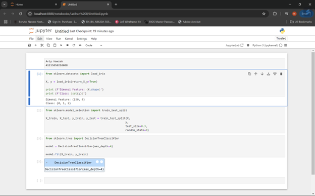  

6)	Training model Decision Tree Classifier 

   

7)	Visualisasi model decision tree

 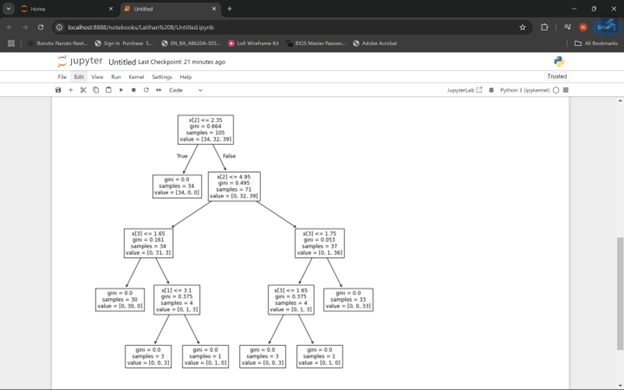  

8)	Evaluasi model Decision Tree

 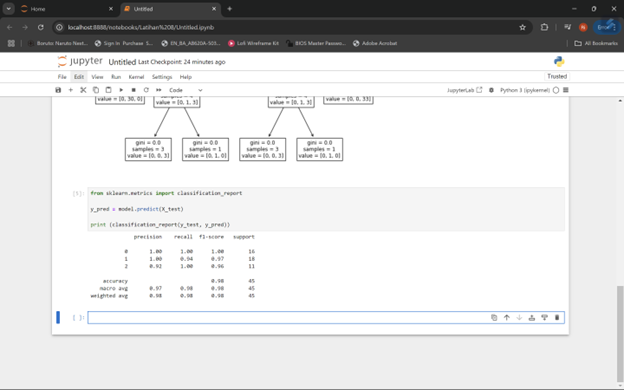  
 
2.	Random Forest Classification 
1)	Proses training model machine learning secara umum 

 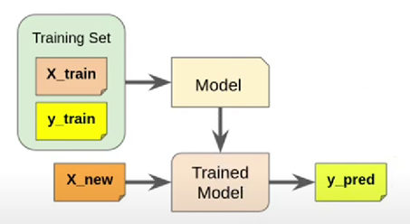  

2)	Pengenalan ensemble learning 
 
 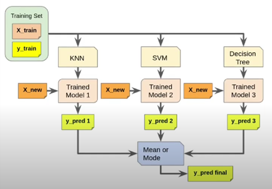  
 
3)	Pengenalan bootstrao aggregating | Bagging 
 
 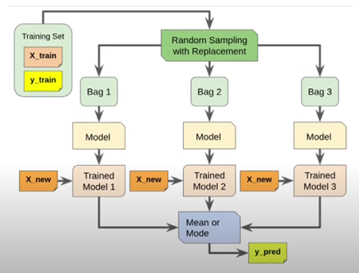  

4)	Pengenalan Random Forest | Hutan Acak 

 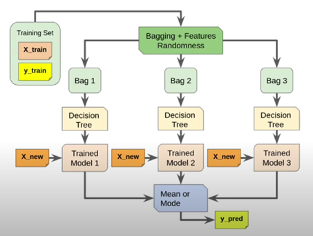  
 
5)	Persiapan dataset | iris Flower dataset
 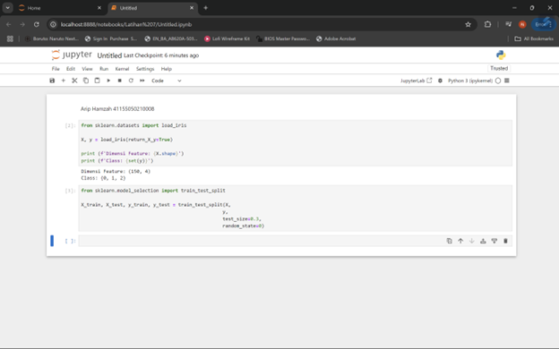  
6)	Implementasi random forest classifier dengan scikit learn 
 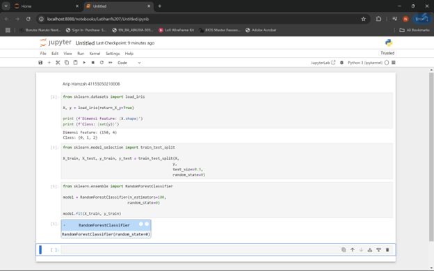  
7)	Evaluasi model dengan Classification Report 
 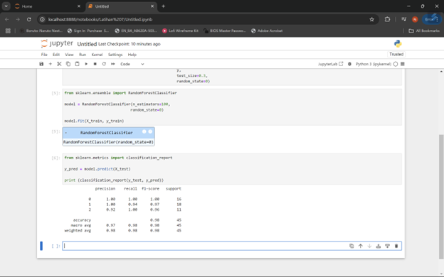  

