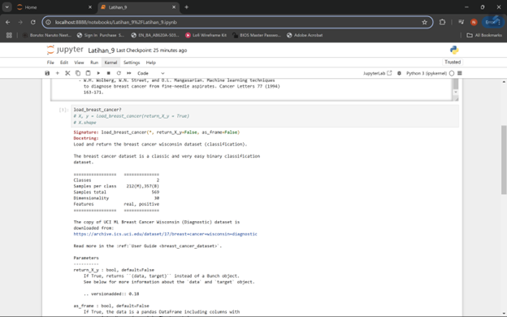
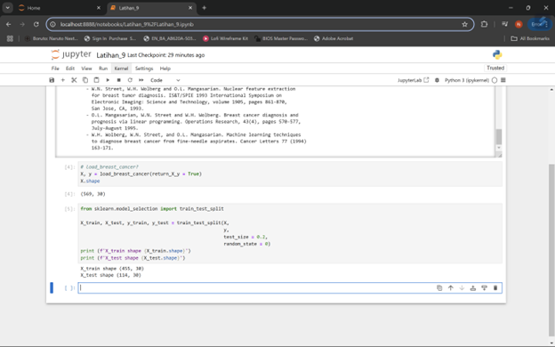

1.	Naïve Bayes Classification 
1)	Pengenalan Bayes Theorem | Teori Bayes | Conditional probability
Teorema Bayes atau yang juga dikenal sebagai Conditional Probability merupakan konsep fundamental dalam statistika yang digunakan untuk menghitung probabilitas suatu kejadian berdasarkan pengetahuan atau kejadian sebelumnya. Teorema ini menjadi dasar matematika yang kuat dalam pengambilan keputusan berbasis probabilitas, dimana kita dapat memperbarui keyakinan kita tentang suatu hipotesis saat mendapatkan bukti atau informasi baru.

     

2)	Pengenalan Naïve Bayes Classification 
Naive Bayes Classification adalah metode klasifikasi yang didasarkan pada teorema Bayes dengan asumsi independensi yang kuat (naif) antara fitur-fitur yang ada. Meskipun asumsi ini terkesan terlalu simplistis karena dalam dunia nyata fitur-fitur biasanya saling terkait, algoritma ini tetap menunjukkan performa yang mengagumkan dalam berbagai aplikasi praktis, terutama dalam klasifikasi teks, deteksi spam email, analisis sentimen, dan sistem rekomendasi.

     

3)	Pengenalan Prior Probability
Prior Probability merupakan probabilitas awal yang kita yakini sebelum melihat bukti atau data baru. Ini adalah pengetahuan awal atau asumsi dasar yang kita miliki tentang suatu kejadian. Dalam konteks klasifikasi email spam, prior probability bisa berupa persentase email spam yang biasa diterima dalam sistem email secara umum, sebelum memeriksa konten spesifik dari email tersebut.
    
      

4)	Pengenalan Likelihood 
Likelihood mengacu pada probabilitas mengamati bukti tertentu jika hipotesis yang kita miliki benar. Dalam prakteknya, likelihood menunjukkan seberapa mungkin kita menemukan karakteristik tertentu dalam sebuah kelas. Misalnya dalam konteks klasifikasi email, likelihood bisa berupa probabilitas munculnya kata-kata tertentu dalam email spam dibandingkan dengan email normal.

     

5)	Pengenalan Evidence | Normalizer
Evidence atau Normalizer berfungsi sebagai faktor normalisasi dalam perhitungan Naive Bayes. Komponen ini memastikan bahwa probabilitas akhir yang dihasilkan tetap berada dalam rentang valid antara 0 dan 1. Evidence merupakan total probabilitas dari semua kemungkinan kejadian yang ada, dan berperan penting dalam menyeimbangkan perhitungan probabilitas keseluruhan.

    

6)	Pengenalan Posterior Probability
Posterior Probability adalah hasil akhir dari perhitungan Naive Bayes, yang merepresentasikan probabilitas setelah mempertimbangkan semua bukti yang ada. Ini merupakan output yang digunakan untuk membuat keputusan klasifikasi final. Posterior probability menggabungkan informasi dari prior probability, likelihood, dan evidence untuk menghasilkan estimasi probabilitas yang lebih akurat berdasarkan semua informasi yang tersedia.

     

     

     
  

PRAKTEK

1.	Load Dataset
 
     

     

      

2.	Training dan Testing Set
 
    

3.	Naïve Bayes dengan Scikit Learn

     
