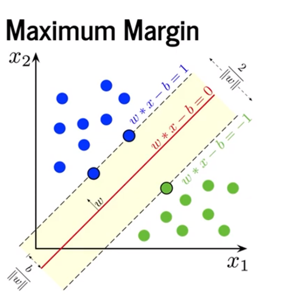
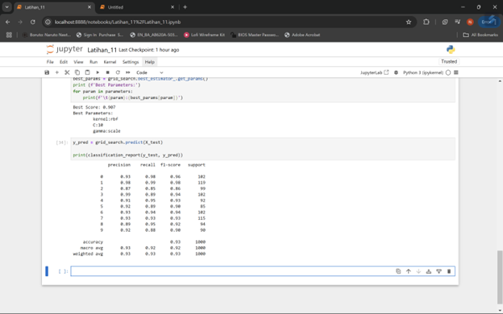

Classification dengna K-NEAREST Neighbours 
1.	Persiapan sample dataset 
 
   

2.	Visualisasi dataset 

   

3.	Pengantar classification dengan K-Nearst Neighbours | KNN 
Model ini akan melakukan prediksi, dalam hal ini akan melakukan prediksi Gender/ jenis kelamin berdasarkan kemiripan karakteristik atau picturs berdasarkan dataset yang kita miliki
4.	Preprocessing dataset dengan Label Binarizer

  

  

5.	Training KNN Classification Model
 
   

6.	Prediksi dengan KNN Classification Model
 
   

7.	Visualisasi Nearest Neighbours
 
   
 

8.	Kalkulasi jarak dengan Euclidean Distance
   
   
   
   

9.	Evaluasi KNN Classification Model | Persiapan testing set
 
   

10.	Evaluasi model dengan accuracy score
 
   

11.	Evaluasi model dengan precision score
 
   

12.	Evaluasi model dengan recall score
 
   

13.	Evaluasi model dengan F1 score
 
   

14.	Evaluasi model dengan classification report
 
   

15.	Evaluasi model dengan Mathews Correlation Coefficient
 
   
 

Classification dengan Support Vector Machine – SVM 

1.	Pengenalan Decision Boundary & Hyperplane
  
  

Decision Boundary adalah garis atau permukaan dalam ruang fitur yang memisahkan kelas-kelas yang berbeda dalam suatu dataset. Pada klasifikasi biner, decision boundary adalah batas yang membedakan antara dua kelas.
Hyperplane adalah konsep yang digunakan dalam Support Vector Machine (SVM). Dalam ruang 2D, hyperplane adalah garis; dalam ruang 3D, itu adalah bidang; dan dalam dimensi lebih tinggi, ini adalah batas yang memisahkan kelas. Hyperplane dipilih sedemikian rupa sehingga memaksimalkan margin antara dua kelas, membantu menghindari overfitting pada data training.

2.	Pengenalan Support Vector & Maximum Margin

  

Support Vectors adalah titik data dalam dataset yang paling dekat dengan hyperplane. Dalam SVM, support vectors adalah elemen penting karena mereka menentukan posisi hyperplane. Perubahan pada support vector akan mengubah posisi hyperplane.
Maximum Margin adalah jarak terbesar antara hyperplane dan titik data terdekat dari kedua kelas. SVM bertujuan untuk menemukan hyperplane dengan margin maksimal agar model lebih general dan memiliki daya prediksi yang baik untuk data baru.

3.	Pengenalan kondisi Linearly Inseparable dan Kernel Tricks

   

Linearly Inseparable terjadi ketika data tidak dapat dipisahkan oleh garis lurus atau hyperplane dalam ruang fitur aslinya. Misalnya, dalam kasus data yang berbentuk lingkaran, garis lurus tidak dapat memisahkan kelas dengan benar.
Kernel Trick adalah teknik yang digunakan SVM untuk menangani data yang tidak dapat dipisahkan secara linear. Dengan kernel, data dapat dipetakan ke dalam dimensi yang lebih tinggi, sehingga menjadi lebih mudah untuk memisahkan kelas dengan hyperplane. Beberapa kernel umum adalah kernel polinomial, RBF (Radial Basis Function), dan sigmoid.

4.	Pengenalan MNIST Handwritten Digits Dataset

   
 
   

5.	Klasifikasi dengan Support Vector Classifier | SVC

   

6.	Hyperparameter Tuning dengan Grid Search
 
   

7.	Evaluasi Model
 
   

  
