Clusterisasi dengan K-MEANS pada Data Konsumen 
1.	Koneksi dengan Google Drive 
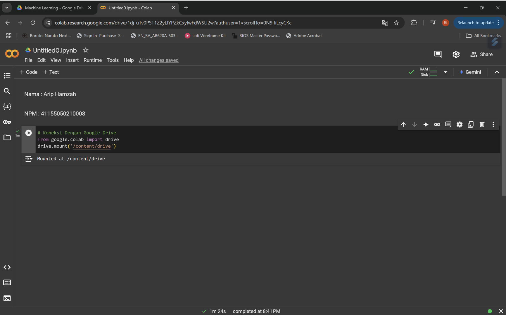
3.	Cek isi Google Drive 
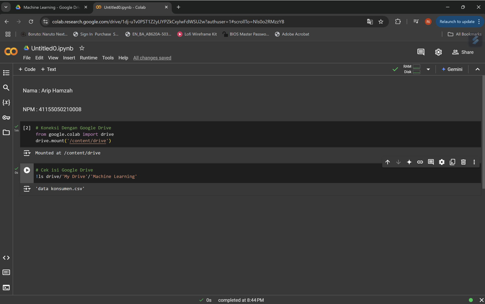
4.	Import Library yang akan digunakan 
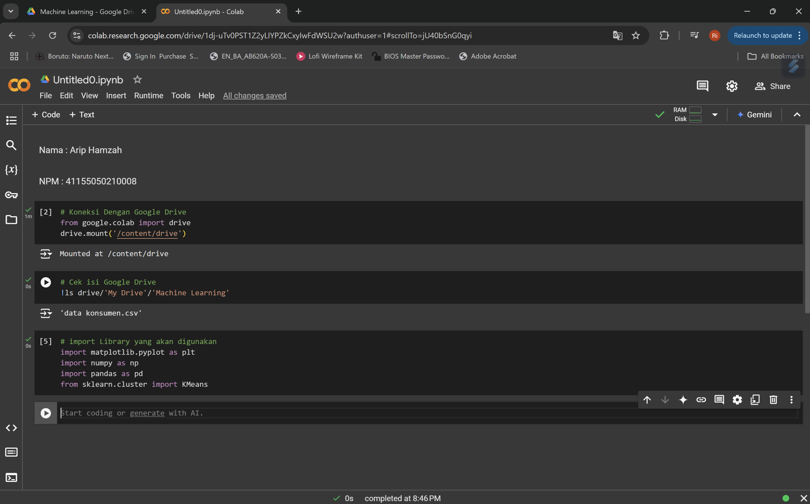
5.	Memanggil Dataset 
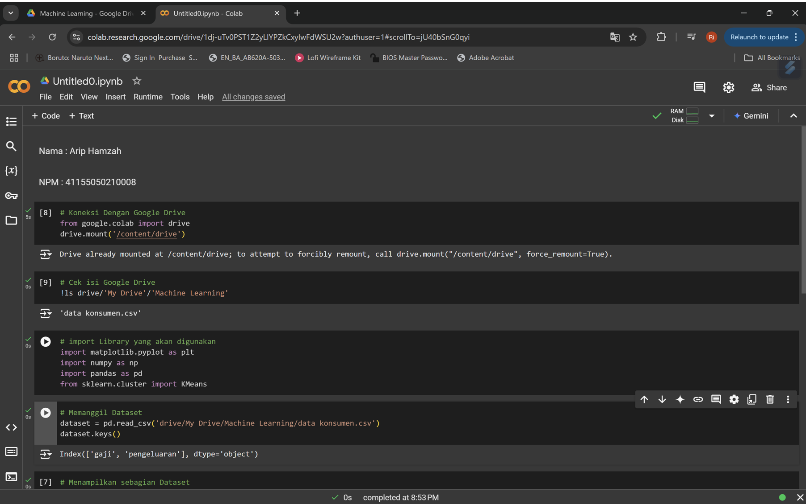 
6.	Menampilkan sebagian dataset
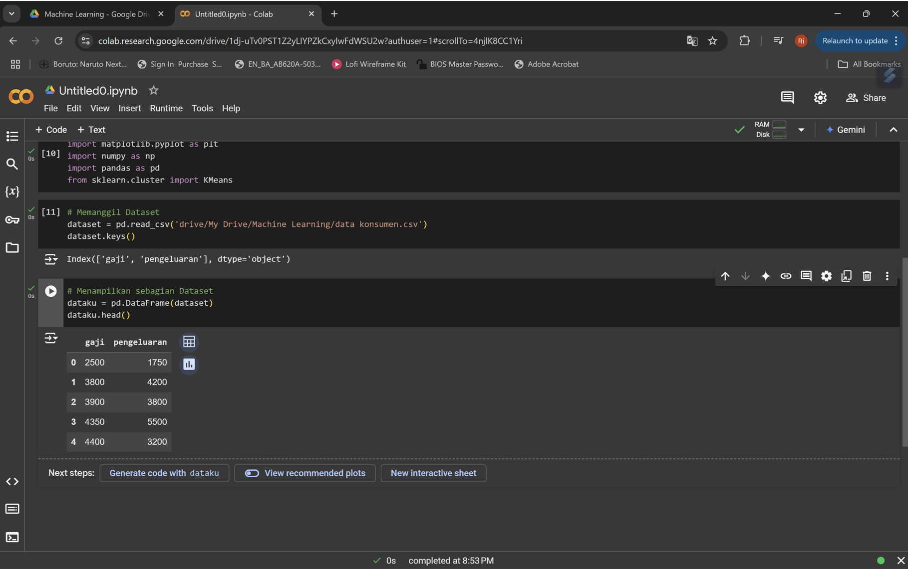 
7.	Konversi ke Data Array 
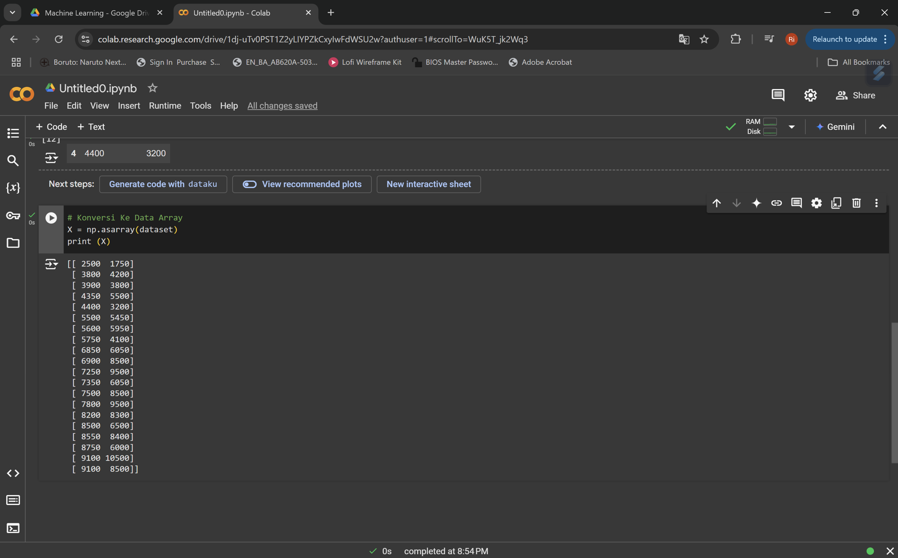 
8.	Menampilkan Data dalam bentuk Scatter Plot
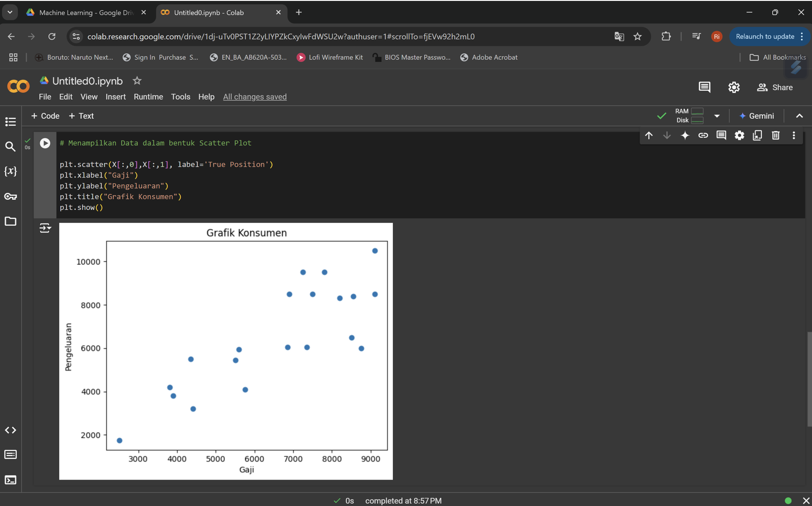 
9.	Mengaktifkan K Means dengan jumlah K = 2
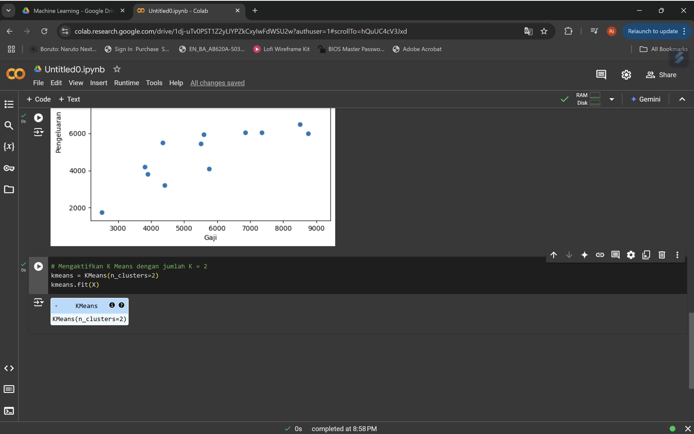 
10.	Menampilkan Nilai Centroid yang akan degenerate oleh Algorithm
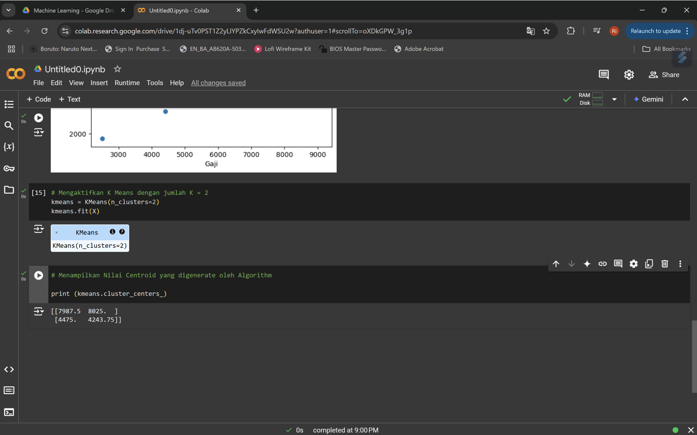 
11.	Menampilkan label data point 
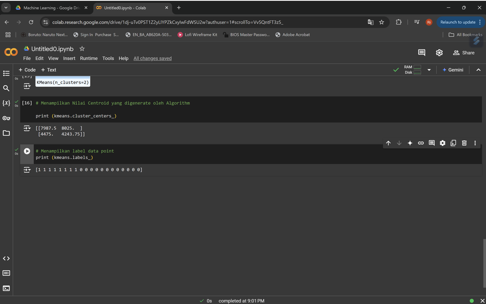 
12.	Plot Data Point (Memvisualisasikan bagaimana data yang telah di klasterisasi)
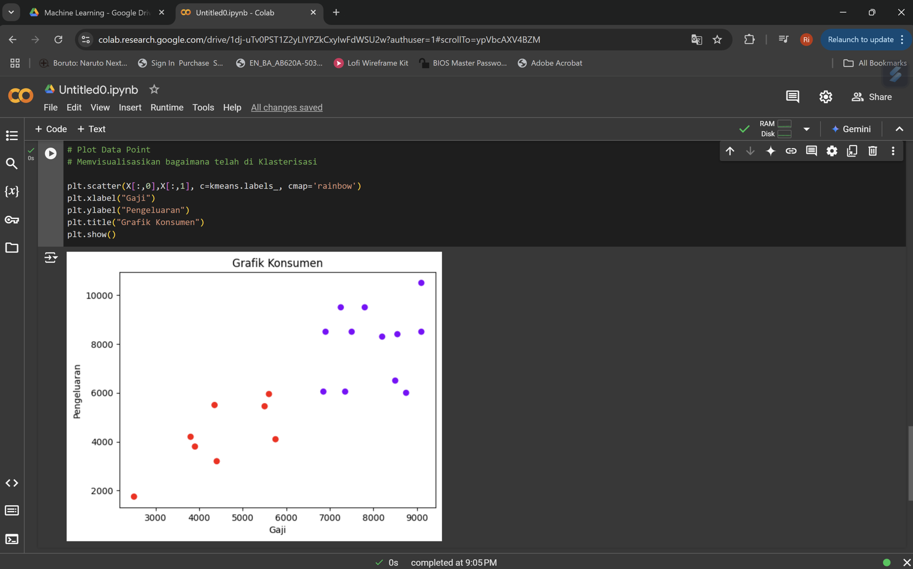 
13.	Plot Data Point (Memvisualisasikan bagaimana data yang telah di klasterisasi) beserta dengan Centroid dengan warna hitam
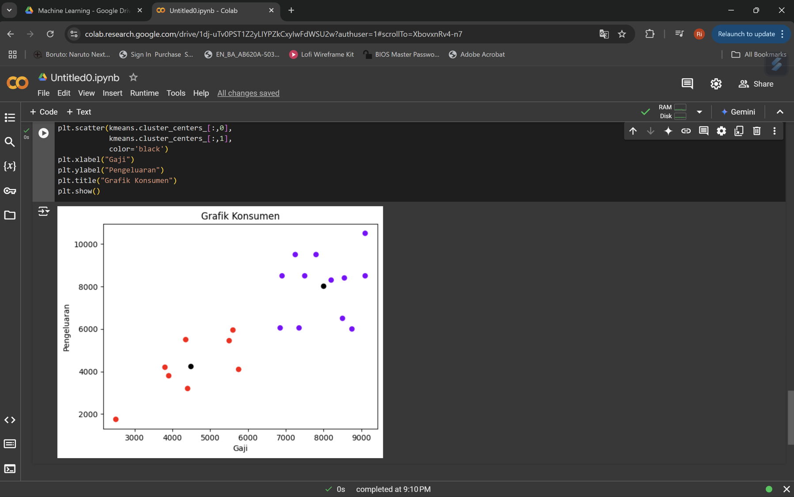 

